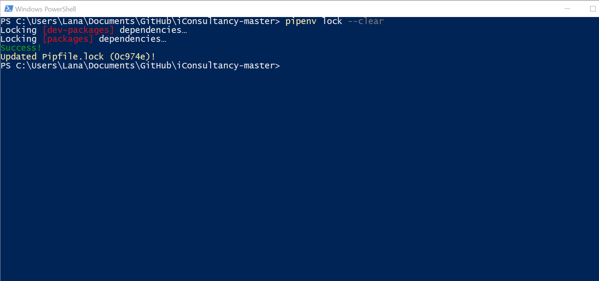
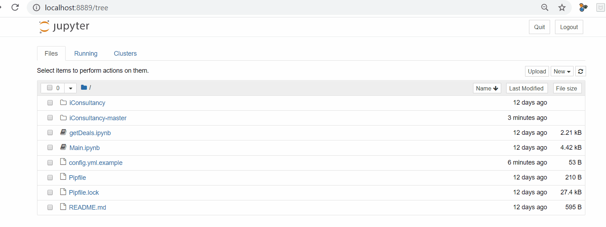

# iConsultancy

## Config
To properly use the ActiveCampgain API features in our code, an URL and key must be specified in a file called `Config.yml`. Use `Config.yml.example` and replace the fields with your own URL and key. Rename this file to Config.yml.

To access the fields in code, first import the file using ```from iConsultancy/config import config``` and you can call on it like a dictionary.

## How to run
1. Installation of Python version 3.8 is needed. This step is only necessary for a one-time installation.
   [Download the latest Python update here!](https://www.python.org/) 
   - If Python is already installed, check to ensure the Python version installed is correct:
     |   OS   |                             Method                               |
     | ------ | ---------------------------------------------------------------- |
     | Windows| Open Windows Powershell and run `python --version` or `python -V`|
     | MacOS  | Open terminal window and run `python --version` or `python -V`   |
     | Linux  | Open terminal window and run `python --version` or `python -V`   |
     
   
2. Installation of `ipywidgets`, an interactive widgets for the Jupyter Notebook.
   - With pip:
    ```
    pip install ipywidgets
    jupyter nbextension enable --py --sys-prefix widgetsnbextension  #Can be skipped for notebook version 5.3 and above
    ```
    This step is only necessary for a one-time installation.
    
3. Clone the git repository.

4. Navigate to the unzipped repository in the terminal.

5. Use `pip` to install `pipenv` and its dependencies
   ```
   pip install pipenv
   ```
   If pipenv is already installed on your device, skip this step. This step is only necessary for a one-time installation. 
   
6. Run `pipenv lock`.
   - `pipenv lock` creates a Pipfile.lock which checks your system to ensure all necessary dependencies are installed and updated based on the pipefile. 
   - Note: If `pipenv lock` is taking more than a few minutes to run, you can try to run the following in the terminal instead:
      ```
      pipenv lock --clear
      ```
7. After a successful updated Pipfile.lock, run these commands:
```
pipenv sync --dev #installs versions specified in the pipefile.lock
pipenv run jupyter notebook #opens Jupyter Notebook in a virtual environment
```
   - You do not need to run `pipenv sync --dev` everytime prior to opening the Jupyter Notebook. 
   - `pipenv sync --dev` is only necessary to install the the exact versions specified in Pipfile.lock
   - The command `pipenv run jupyter notebook` is needed everytime to access the Jupyter Notebook.
   
Below is a quick demo for how to run Step 6 and Step 7:


8. Once Juypter Notebook is running, open the `config.yml.example` file.
9. Replace the URLHERE and KEYHERE fields with your own ActiveCampaign URL and KEY, save, and rename the file `config.yml`
   Everytime the URL and KEY change, ensure the `config.yml` file is updated to reflect the new URL and KEY.
   

